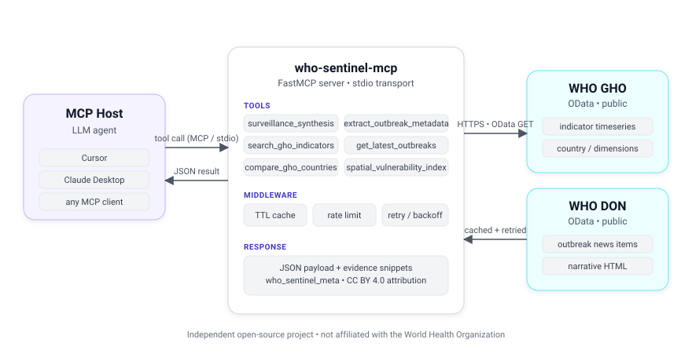

# who-sentinel-mcp

[](https://www.python.org/downloads/)
[](https://modelcontextprotocol.io/)
[](LICENSE)
[](https://github.com/astral-sh/ruff)

A small [Model Context Protocol](https://modelcontextprotocol.io/) server that lets an LLM ask grounded questions about WHO public-health data: indicator timeseries from the [Global Health Observatory](https://ghoapi.azureedge.net/api) (GHO) and recent stories from [Disease Outbreak News](https://www.who.int/emergencies/disease-outbreak-news) (DON).

> **Not affiliated with the World Health Organization.** This is an independent open-source project that consumes WHO's public APIs. WHO content is used under [CC BY 4.0](https://www.who.int/data/gho/publications/licensing) and every tool response carries an attribution line.

<p align="center">
  
</p>

## Why

Asking an LLM about an outbreak in country *X* tends to produce confident-sounding case counts and stale baselines. This server gives the model a small, opinionated set of tools so it can:

- look up an indicator code instead of guessing one,
- pull the country's actual GHO timeseries,
- compare the latest value against a prior-years baseline,
- surface recent DON items with a real public URL,
- pull regex/heuristic case-and-CFR hints out of DON narratives — with confidence flags so the model knows when not to quote them,
- read the published INFORM Risk Index for a country (UN OCHA / EC JRC, via HDX HAPI) instead of inventing a composite.

Intended for **research, teaching, and desk analysis**.

## Install

Requires [`uv`](https://docs.astral.sh/uv/) and Python 3.10+ (the repo pins 3.11 via `.python-version`).

```bash
uv sync
```

## Run

```bash
uv run who-sentinel-mcp
```

The process speaks MCP over stdio, so don't run it interactively in a terminal — point an MCP host at it.

### Cursor / Claude Desktop / etc.

```json
{
  "mcpServers": {
    "who-sentinel": {
      "command": "uv",
      "args": ["run", "who-sentinel-mcp"],
      "cwd": "/absolute/path/to/who-sentinel-mcp"
    }
  }
}
```

### Docker

```bash
docker build -t who-sentinel-mcp .
docker run -i --rm who-sentinel-mcp
```

## Tools

| Tool | What it does |
| --- | --- |
| `search_gho_indicators` | Find `IndicatorCode` values by keyword. |
| `list_gho_countries` | Full WHO `RegionCountry` table, optional substring filter. |
| `resolve_gho_country` | Resolve a free-text country / ISO3 to a `RegionCountry` row. |
| `list_gho_indicator_dimensions` | Dimensions for one indicator (e.g. COUNTRY, YEAR). |
| `list_gho_entity_sets` | Browse the GHO `/api` catalog (~3000 entity sets). |
| `get_latest_outbreaks` | Recent DON items, optional disease keyword filter. |
| `get_full_report` | Full DON record by `Id`, plus `public_url`. |
| `extract_outbreak_metadata` | Regex/heuristic case & CFR hints from DON text. |
| `surveillance_synthesis` | DON narrative + GHO baseline for one disease/country. Refuses by default if the picked `IndicatorCode` shares no keywords with the disease query (`code_validation`); pass `confirm_indicator=true` to override. |
| `compare_gho_countries` | Same indicator across two countries. |
| `country_risk_index` | Latest INFORM Risk Index scores (UN OCHA / EC JRC, via [HDX HAPI](https://hapi.humdata.org/)) for a country. |
| `get_server_limits` | Effective cache TTLs, rate-limit budget, in-process metrics. |

Resources (for agent context):

- `who-sentinel://docs/gho-basics`
- `who-sentinel://docs/limitations`
- `who-sentinel://docs/trust-and-use`

Prompt: `who_sentinel_workflow` — a short suggested workflow for agents.

## Configuration

| Variable | Default | Meaning |
| --- | --- | --- |
| `WHO_SENTINEL_CACHE_TTL` | `86400` | GHO series / indicator cache TTL (seconds). |
| `WHO_SENTINEL_COUNTRY_REGISTRY_TTL` | `604800` | TTL for the `RegionCountry` + `/api` catalog. |
| `WHO_SENTINEL_LOG_LEVEL` | `WARNING` | Stdlib log level. `DEBUG` includes Python tracebacks in tool error payloads. |
| `WHO_SENTINEL_MAX_HTTP_PER_MINUTE` | `120` | Token-bucket cap on outbound GETs. `0` = unlimited. |
| `WHO_SENTINEL_GHO_BASE` | `https://ghoapi.azureedge.net/api` | GHO OData base URL. |
| `WHO_SENTINEL_DON_BASE` | `https://www.who.int/api/news/diseaseoutbreaknews` | DON OData base URL. |
| `WHO_SENTINEL_WHO_WEB_BASE` | `https://www.who.int` | Base used when building DON `public_url`s. |
| `WHO_SENTINEL_HDX_HAPI_BASE` | `https://hapi.humdata.org` | HDX HAPI base URL for `country_risk_index`. |
| `WHO_SENTINEL_HDX_APP_ID` | _(unset)_ | Required for `country_risk_index`. Generate one at the [HAPI sandbox](https://hapi.humdata.org/docs#/Utility/get_encoded_identifier_api_v1_encode_identifier_get). |

GETs retry on `408, 429, 502, 503, 504` with exponential backoff and respect `Retry-After`.

## How `surveillance_synthesis` thinks

1. Resolve the country via `resolve_gho_country` / `list_gho_countries`.
2. If `indicator_code` is omitted, the response carries `indicator_candidates` (curated hints first, then live GHO search) so the model can pick one and call back.
3. With an `indicator_code`, the default baseline is **latest year vs the mean of up to 10 prior years** in that GHO series. Override with `prior_years_for_baseline` (1–20) and/or `baseline_latest_year` to anchor the "latest" point.
4. The `latest` block surfaces `gho_last_updated`, `period_begin`/`period_end`, and `value_low` / `value_high` when WHO publishes them.
5. DON excerpts include a real `public_url` (`https://www.who.int` + `ItemDefaultUrl`).
6. Every payload carries `who_sentinel_meta.disclaimer` next to the CC BY attribution line.

## Limitations

- GHO uses **per-indicator** entity sets. `surveillance_synthesis` adds a `code_validation` field and refuses by default when the IndicatorName shares no keywords with the disease query, but a high-confidence pick can still be wrong — `code_provenance` shows where the code came from; verify via `search_gho_indicators` and `list_gho_indicator_dimensions`.
- Disease hints come from `data/disease_hints.json` — a small editorial overlay merged with an auto-generated snapshot of the live GHO `Indicator` catalog (refreshed weekly by `scripts/refresh_disease_hints.py`). Still starting points, not authoritative.
- DON country matching is text-based. We expand each country into pycountry names + an alias overlay (e.g. `DRC`, `Burma`, `Côte d'Ivoire`), and ISO3 codes use word boundaries, but narratives can still use subnational place names.
- `extract_outbreak_metadata` uses regex heuristics. Inspect `confidence` and `cfr_source` (`explicit_text` vs `derived_or_none`) before quoting numbers.
- `country_risk_index` is a thin passthrough of the published INFORM Risk Index (CC BY 4.0); we don't compute composites of our own. Set `WHO_SENTINEL_HDX_APP_ID` to enable it.

## Development

```bash
uv sync --all-groups
uv run ruff check .
uv run pytest
```

CI runs `uv sync --locked`, ruff, and pytest. Integration-style tests use mocked HTTP only — no live WHO calls in CI.

## License

Code is released under the [MIT License](LICENSE). WHO data is used under [CC BY 4.0](https://www.who.int/data/gho/publications/licensing); see the attribution line prefixed on every tool response.
